# Project Report: CPU-Scheduler

**Garvit Khurana**  
Department of Electrical Engineering  
22115059

## Project Overview

CPU-Scheduler is a desktop application which allows users to see on a ground level how our CPU schedules the processes which are running in our real-time systems. A total of 4 CPU scheduling algorithms are implemented which are First Come First Serve (FCFS), Round Robin (RR), Preemptive Shortest Job First also known as Shortest Remaining Time (SRT), and Multi-Level Queue Scheduling (MLQ). The key feature is Auto-Scheduling, which decides based on process information which algorithm will be more appropriate. A Gantt-Chart showing the start and completion time of a process and average statistics of the chosen algorithm are displayed along with it.

The report clearly explains both textually and visually through images how the front-end of the application looks as well as the implementation of the back-end, which involves the algorithms. The Tech Stack used for the back-end is C++, and the front-end uses JavaScript and its framework Electron to build the window application. The challenges faced and possible updates or features which can be added are discussed at the end of the report.

## Table of Contents

1. [Phases of Building CPU-Scheduler](#phases-of-building-cpu-scheduler)
2. [Flowcharts & Diagrams](#flowcharts--diagrams)
3. [Front-end Behaviour & Implementation](#front-end-behaviour--implementation)
4. [Back-end Algorithms](#back-end-algorithms)
5. [Challenges Faced](#challenges-faced)
6. [Possible Upcoming Updates & Features](#possible-upcoming-updates--features)
7. [Dependencies & Conditions](#dependencies--conditions)

## Phases of Building CPU-Scheduler

- **Learning Terminologies**: Since I was new to this, I first learned about why we actually needed a CPU scheduler and the terms associated with process information. I learned about process ID, Arrival Time, Burst Time, Priority, Start Time, Completion Time, and criteria of scheduling which involve Waiting Time, Response, and Turn Around Time.
- **Learning Algorithms**: There are many algorithms and each one of them has its own use case. Learning all of them at once took a bit of time but with dry run it got more and more clear in my mind how I will implement this particular algorithm. As stated earlier, I used **First Come First Serve (FCFS), Round Robin (RR), Preemptive Shortest Job First also known as Shortest Remaining Time (SRT), and Multi-Level Queue Scheduling (MLQ)**.
- **Implementing Back-end**: I wanted to have a clean and self-explanatory directory structure so I separated each algorithm as a header file and included it in main **scheduler.cpp**. Most of my time went in this phase, especially thinking of the logic of how I will link it with the front-end part. Out of them, the most difficult was implementing MLQ as it has some edge cases which are discussed in the later part of the report.
- **Implementing front-end**: While web-surfing, I came to know about a few ways and I tried each one of them but faced issues which are discussed in the last portion of this report. Finally, I came to know that making a desktop application using **electron.js** will be the most straightforward and convenient to build. Since this was new to me, I used the documentation code of the Electron framework available on the internet. The HTML and CSS part wasn't a big deal but consumed a good amount of time. The main part of this phase was merging this interactive application with my C++ scheduler file which is already explained too in the later part of this report.

This was how I went through the journey of making this project. To understand it visually, diagrams and flowcharts are added in the next section.

## Flowcharts & Diagrams

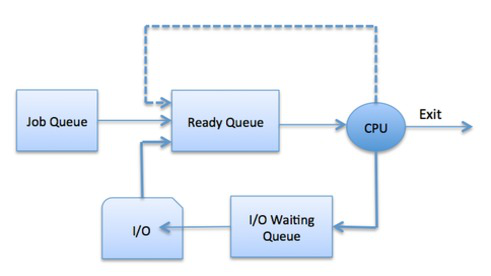  
**Figure 1: Queuing Diagram**

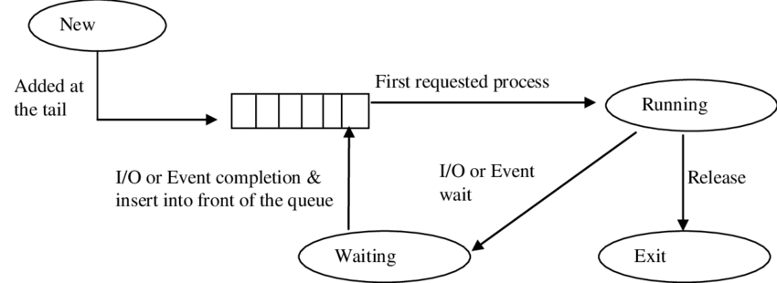  
**Figure 2: First Come First Serve Algorithm**

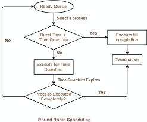  
**Figure 3: Round Robin Algorithm**

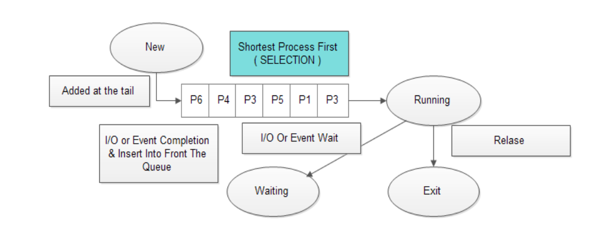  
**Figure 4: Shortest Job First Algorithm**

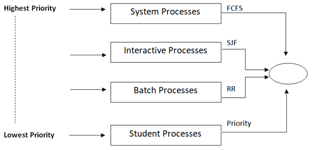  
**Figure 5: General Multilevel Queue Algorithm**

I hope with these flowcharts and diagrams you are able to understand a little bit about what actually happens in the respective algorithms. There are more existing algorithms which are discussed in the last portion of the report but first, let's go into the implementation of the code base from the next section.

## Front-end Behaviour & Implementation

- CPU-Scheduler's front-end is written in HTML, CSS, and Javascript. First, let's see how it will look if you open the Application.

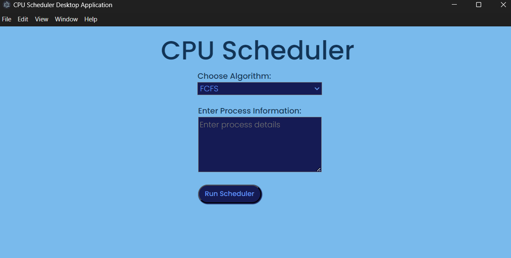  
**Figure 6: Application Front-end Look**

- There are a total of 3 features which include Algorithm Selector input, Text Area to give process details, and a Run Schedule Button. The moment you click on the button after providing valid information, 3 more things will appear which include each process's details including the calculated details associated with each one of them that is completion time, start time, etc. Secondly, Average Stats of the algorithm and the Gantt-Chart in the end. Let me show it first.

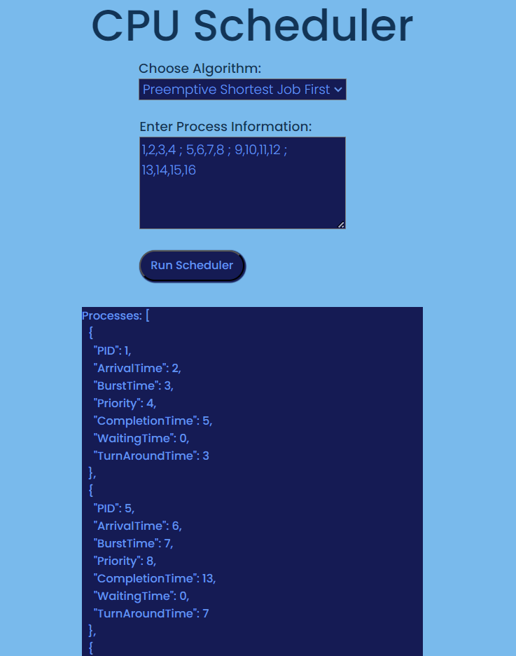  

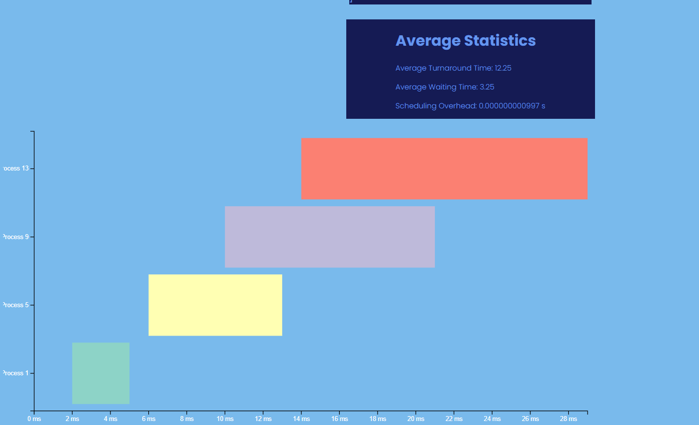  
**Figure 7: After Running Algorithm**

- Let's go through some code snippets and we will be going in order how these files are connected to each other and explaining their functionalities.

- **HTML Structure**: This file consists of the basic structure of how our window will look the moment you run the application.

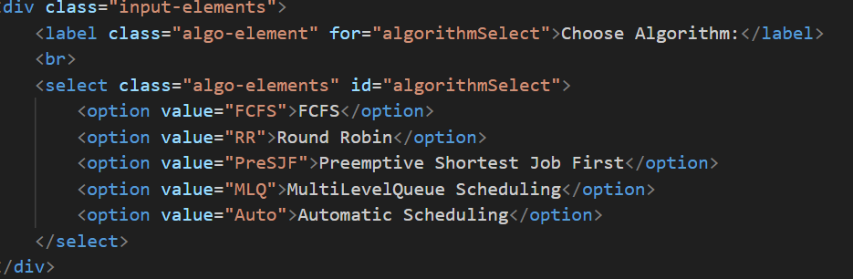  
**Figure 8: HTML Code Snippet**

- Here I have created a div element which includes a select input type HTML element. The algorithms chosen by me are just listed down here.

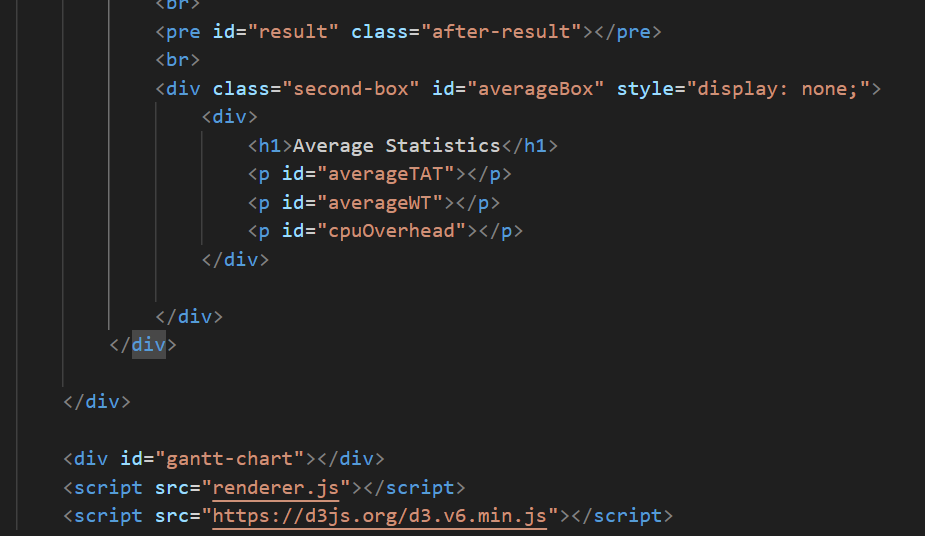  
**Figure 9: HTML Code Snippet**

- A **pre** element is created which initially is empty and the average statistics div has a display of none. The reason for doing this is to make them appear only when a user runs the algorithm. You can see a script is being loaded. Yes, there are two scripts needed, one which is **renderer.js** which consists of logic for the button and changing the layout of the HTML structure whenever it receives the result. Secondly, a **D3 Script File** which is required for making the Gantt-Chart.

- I don't think there is a need of explaining **CSS Style File** as it just contains the information of font, color used, and margin. In my Application, I used different **shades of blue color** and the font is **poppins, sans-serif** took from **Googlefonts site**. So let's go to JavaScript Files and see their logic.

- **Renderer.js & Main.js**: The renderer file is in direct link with HTML files and associated with sending messages of the user.

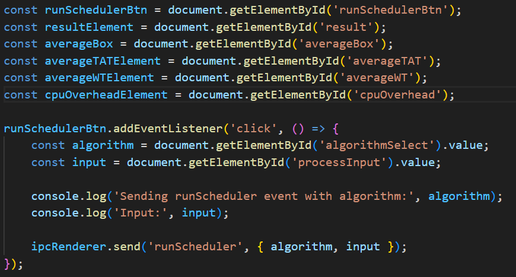  
**Figure 10: Renderer.JS Code Snippet**

- This is how event listeners are added that is by fetching the HTML element by their ID. There are multiple ways to do so such as doing it by class or querySelector. Here you can see I added a listener of click on the button because the moment the user performs this action we must take the algorithm value in form of string and the process details and send them to the **Main.js** file which will listen for such a command that is **runScheduler**.

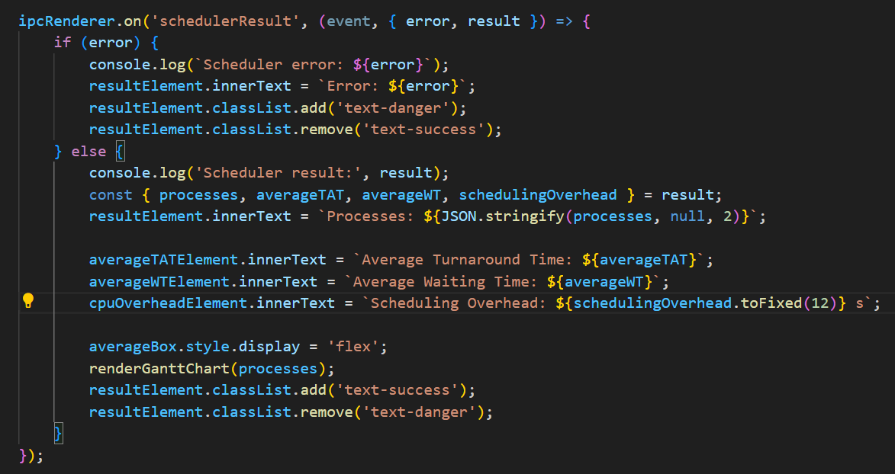  
**Figure 11: Inter-Process Communication**

- ipcRenderer is a feature provided by the JavaScript **Electron Framework** which helps to receive and send messages to the main and vice versa. Here on receiving the results from the main with no errors then we will change the text of that HTML document. At last, a Gantt-Chart render function will be called where we used **D3.js** to make bars whose starting point and endpoints are already calculated in the processes array. That function includes basic styling and adjustments and is available in the D3 framework's documentation on the internet.

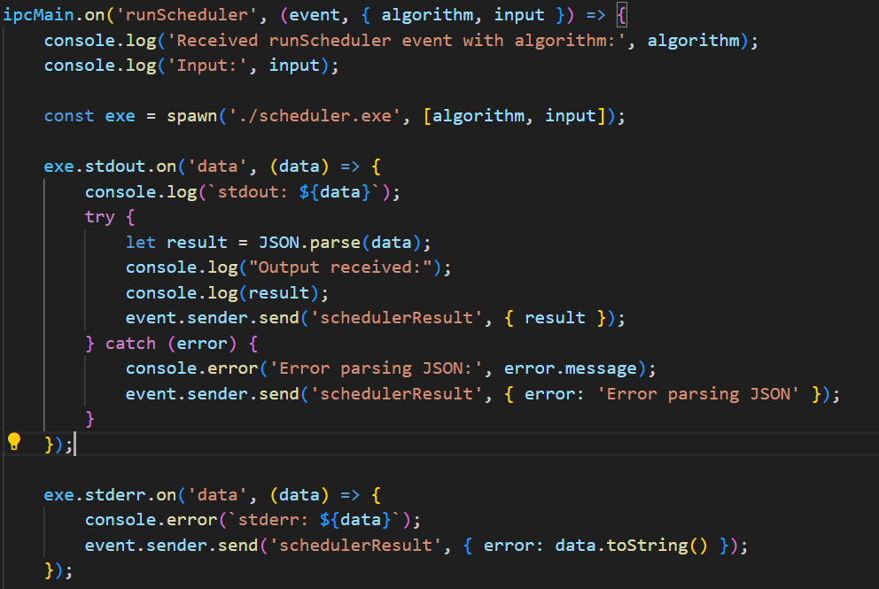  
**Figure 12: Main.JS Code Snippet**

- So this basic callback function is what interacts with our **C++ EXE** file. Whatever the standard output is coming in the exe file we are reading this and we specifically made the output of the scheduler file in the form of an array of string so that we can read it in context with JavaScript.

- Now let's look at our back-end files too. **Please go to the next page**.

## Back-end Algorithms

- Instead of explaining the algorithm here, I will be explaining how things are organized because that algorithm part could be easily understood from Neso Academy YouTube Channel (resource given by ACM club). So here it goes:

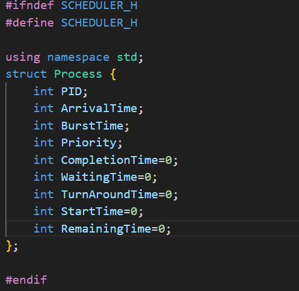  
**Figure 13: Process Structure Block**

- This is a header file which will be included in almost all files and defines a particular process object. Some of the information will be given by the user while others will be calculated after the execution of the algorithm.
- Just like this all algorithms are stored as header files and will be included in our **scheduler.cpp** file which handles the main execution of the back-end. Let's check that file as it is the core of our back-end.

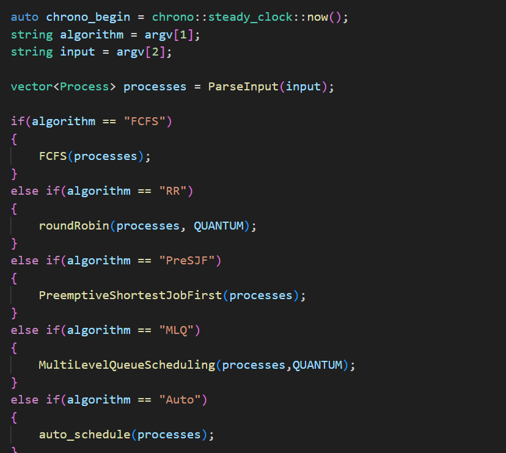  
**Figure 14: Calling Algorithms**

- This is the topmost portion of the file where header files are included and 2 vectors are initialized. One which will be an input of processes given by the user and others will be calculated information.
- Then after we read input and check the value of the algorithm if it is equal to FCFS we call the FCFS algorithm with the vector of processes and output the result. Just like that if a user asks for Auto-Scheduling, a function call of the respective method will be made and processes will be returned accordingly.

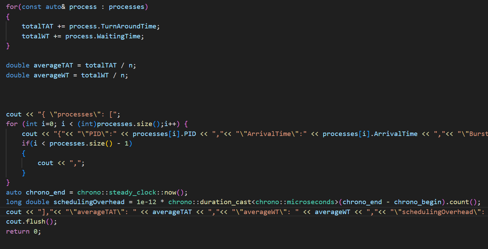  
**Figure 15: Vector Data Read**

## Challenges Faced

- **Choosing the correct framework**: First I chose HTML and CSS as my front end because I was a little bit familiar with it but the real issue was integrating it with my scheduler back end. I asked my friend who suggested me to use React.js and some suggested using Pistache, but I didn't have enough time to learn both. So while I was surfing, I found out about **electron.js** which was very much simple and can make an attractive Desktop application and so I used this framework.
- **Edge Cases for Algorithms**: Every algorithm has its own edge cases such as MLQ where sometimes a process has to wait for a long time as it must finish the processes of queues which are of higher priority. Some user-provided input information may have non-integer arrival time which was out of my scope of algorithm functionality, so I restricted the input by giving a message to provide valid input details.
- **No Fixed Resource for CPU-Scheduling Algorithms**: I had to search on many websites to get a good resource for reading these algorithms and understanding them from an implementation point of view. Although there are a few channels like Neso Academy on YouTube, they were discussing more on the theoretical part. At last, I had to combine 3-4 such sites to get the full overview and implemented them accordingly. 

## Possible Upcoming Updates & Features

- **Implementing More Algorithms**: This will give a more clear and broad perspective to the user who is seeing our desktop application and help understand a particular algorithm in more detail.
- **Visualization of the CPU-Scheduler**: This will give a more clear perspective in terms of seeing the flow of a particular algorithm. Currently, it is restricted to process details in the form of text and a Gantt-Chart. More work could be done to add this feature.
- **Different Color Schemes**: Currently, it is a normal dark and light mode but in the future, we could give the user a chance to change color schemes according to their choice and preferences.

## Dependencies & Conditions

- **C++**: Used as the back-end Language
- **Electron.js**: Used as front-end Framework
- **D3.js**: Used to make Gantt-Chart Bars

**Condition**: All input process details must be given in positive numbers only.
